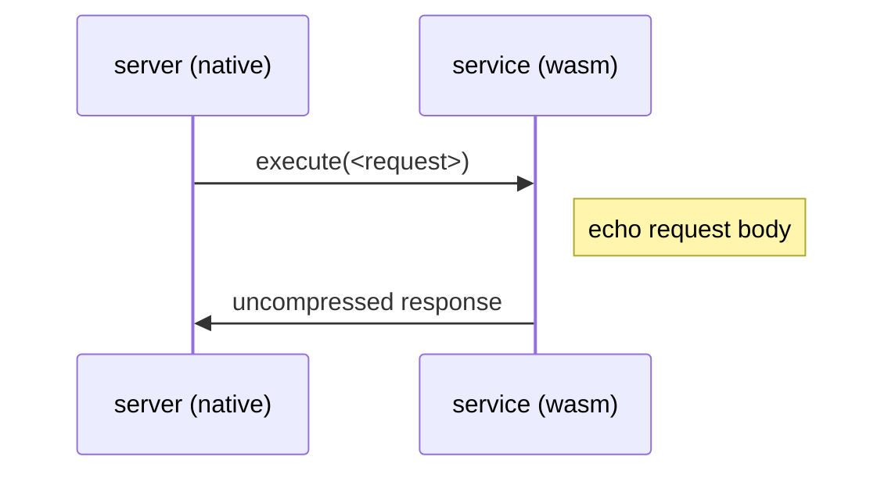
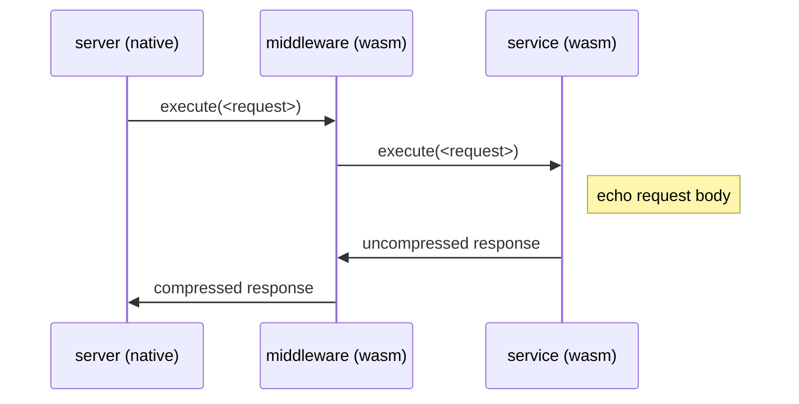

# Component composition example

This directory contains an example of how to use `wasm-compose`
to compose a component from other components.

## Directory layout

There are three subdirectories in this example:

* `service` - a service component that responds with the original request body.
* `middleware` - a middleware component that compresses response bodies.
* `server` - a custom HTTP server that instantiates a service component for
  each HTTP request.

## Overview

The server will listen for `POST` requests at `http://localhost:8080`. 

When it receives a request, the server will instantiate a service component
and forward it the request.

Each service implements a `handler` interface defined in `service.wit` as:

```wit
interface handler {
    record request {
        headers: list<tuple<list<u8>, list<u8>>>,
        body: list<u8>,
    }

    record response {
        headers: list<tuple<list<u8>, list<u8>>>,
        body: list<u8>
    }

    enum error {
        bad-request,
    }

    execute: func(req: request) -> result<response, error>
}
```

A service handler will be passed a `request` containing only the headers and 
body and respond with a `response` containing only the headers and body.

Note that this is an overly-simplistic (and inefficient) interface for 
describing HTTP request processing.

### Execution flow

The example implements a `service` component that initially executes like
this:



With a simple change to how the `service` component is composed, we can
inject a `middleware` component that will gzip compress the response body,
altering the execution flow to this:



All this without having to rebuild any of the original components!

## Getting started

The components in this example will be built with [`cargo component`](https://github.com/bytecodealliance/cargo-component).

Follow the [installation instructions](https://github.com/bytecodealliance/cargo-component#installation)
to install `cargo component` locally.

Additionally, it is assumed that `wasm-tools` has been installed from the
root of this repository.

## Building the components

To build the `service` component, use `cargo component build`:

```sh
cd service
cargo component build --release
```

To build the `middleware` component, use `cargo component build`:

```sh
cd middleware
cargo component build --release
```

## Running the server

Initially, we will run the server with the `service` component that responds
with an uncompressed response body.

The server can be run with `cargo run`:

```sh
cd server
cargo run --release -- ../service/target/wasm32-unknown-unknown/release/svc.wasm
```

This will start a HTTP server that listens at `http://localhost:8080`.

## Sending a request

Use `curl` to send a request to the service:

```
$ curl localhost:8080 -d 'Hello, world!' -H "Content-Type: text/plain" -v
```

This should output something like this:

```
*   Trying 127.0.0.1:8080...
* connect to 127.0.0.1 port 8080 failed: Connection refused
*   Trying ::1:8080...
* Connected to localhost (::1) port 8080 (#0)
> POST / HTTP/1.1
> Host: localhost:8080
> User-Agent: curl/7.79.1
> Accept: */*
> Content-Type: text/plain
> Content-Length: 13
> 
* Mark bundle as not supporting multiuse
< HTTP/1.1 200 OK
< content-length: 35
< content-type: text/plain
< date: Fri, 05 Aug 2022 01:39:43 GMT
< 
* Connection #0 to host localhost left intact
The request body was: Hello, world!
```

Note that the response body matches the request body, but it was not
compressed.

## Composing with a middleware

If we want to instead compress the response bodies for the service, we can 
easily compose a new component that sends requests through the `middleware` 
component without rebuilding any of the previously built components.

The `server/config.yml` file contains the configuration needed to compose a new
component from the `service` and `middleware` components.

Run `wasm-compose` to compose the new component:

```sh
cd server
wasm-tools compose -c config.yml -o service.wasm ../middleware/target/wasm32-unknown-unknown/release/middleware.wasm
```

This results in a new `service.wasm` in the `server` directory where the
`middleware` component is now used.

## Running the server again

If you haven't already, stop the currently running server by pressing `ctrl-c`.

Start the server again with `cargo run` with the newly composed component:

```sh
cd server
cargo run --release -- service.wasm
```

The server should again be listening for requests at `http://localhost:8080`.

## Sending one more request

Use `curl` to send a request to the service, but this time pass the
`--compressed` option:

```
$ curl localhost:8080 -d 'Hello, world!' -H "Content-Type: text/plain" -v --compressed
```

This should output something like this:

```
*   Trying 127.0.0.1:8080...
* connect to 127.0.0.1 port 8080 failed: Connection refused
*   Trying ::1:8080...
* Connected to localhost (::1) port 8080 (#0)
> POST / HTTP/1.1
> Host: localhost:8080
> User-Agent: curl/7.79.1
> Accept: */*
> Accept-Encoding: deflate, gzip
> Content-Type: text/plain
> Content-Length: 13
> 
* Mark bundle as not supporting multiuse
< HTTP/1.1 200 OK
< content-encoding: gzip
< content-length: 58
< content-type: text/plain
< date: Fri, 05 Aug 2022 01:47:59 GMT
< 
* Connection #0 to host localhost left intact
The request body was: Hello, world!
```

Note the response used `gzip` for the content encoding.

With such a small response body, the compressed size is actually _bigger_
than the uncompressed size.

## Towards the future

This example will hopefully continue to evolve with the component model
proposal.

Notably, requests and responses will be modeled as _resources_ once the
proposal (and Wasmtime) supports them.

This will enable the service to incrementally read data from the request
body instead of passing it all in at once, for example.

Additionally, the component model proposal will some day support
asynchronous calls. This will enable the service to be invoked
asynchronously rather than blocking the request thread like it does today.
