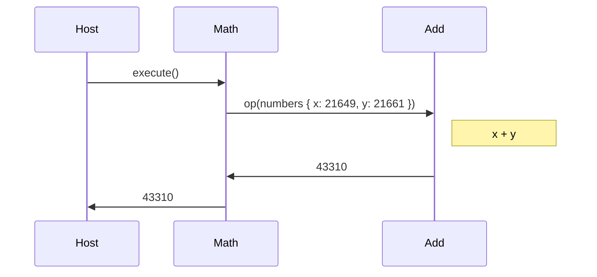
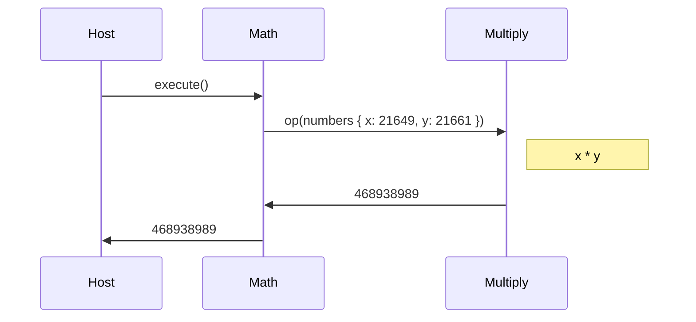

# Component composition example

This directory contains a simple example of how to use `wasm-compose`
to compose a component from other components.

## Directory layout

There are four subdirectories in this example:

* `add` - a simple component that adds two numbers together.
* `multiply` - a simple component that multiplies two numbers together.
* `math` - a simple component that imports an _operation_ interface and
  passes it two numbers.
* `host` - a custom host that instantiates a `math` component and calls
  its `execute` export.

## Overview

The _operation_ interface is defined in `op.wit` as:

```wit
record numbers {
    x: u32,
    y: u32,
}

op: func(nums: numbers) -> u32
```
While obviously the numbers could be passed as individual parameters, rather
than via a record, this example is meant to illustrate passing interface types
between components.

The interface has been defined in terms of what is supported in [Wasmtime](https://github.com/bytecodealliance/wasmtime)
at the time of this writing. This example will evolve as the support for the
component model evolves in Wasmtime.

The example will compose a `math` component that initially will execute like
this:



By changing how the `math` component is composed, the execution will
change to:



All without having to rebuild any of the original components!

## Getting started

The components in this example will be built with [`cargo component`](https://github.com/bytecodealliance/cargo-component).

Follow the [installation instructions](https://github.com/bytecodealliance/cargo-component#installation)
to install `cargo component` locally.

Additionally, it is assumed that `wasm-tools` has been installed from the root of this repository.

## Building the components

To build the `add` component, use `cargo component build`:

```sh
cd add
cargo component build --release
```

To build the `multiply` component, use `cargo component build`:

```sh
cd multiply
cargo component build --release
```

Finally, to build the `math` component, use `cargo component build`:

```sh
cd math
cargo component build --release
```

## Composing the component

Initially, the host defines a composition configuration for the `math` component
that looks like this:

```yml
output: math.wasm

components:
  add:
    path: ../add/target/wasm32-unknown-unknown/release/add.wasm
  multiply:
    path: ../multiply/target/wasm32-unknown-unknown/release/multiply.wasm
  math:
    path: ../math/target/wasm32-unknown-unknown/release/math.wasm

instantiations:
  math:
    dependencies: [add]

exports:
  default: math
```

This configuration will instantiate the `add` component and pass it as an
argument to the instantiation of the `math` component.

It will then export the default interface of the original `math` component
so it can run in a host that expects a `math` component.

It's important to note that this configuration embeds the original
components in the composed component because Wasmtime does not support
component imports currently.

To compose a `math` component that adds two numbers together:

```sh
cd host
wasm-tools compose
```

There should now be a `math.wasm` in the `host` directory.

## Running the host

The host can be run with `cargo run`:

```sh
cd host
cargo run --release
```

This should output `43310` because the "operation" of the composed component
was defined by the `add` component.

## Changing the composition

To change the composition of the `math` component run by the host, edit
`./host/wasm-compose.yml` and change the following line:

```yml
    dependencies: [add]
```

to:

```yml
    dependencies: [multiply]
```

And run `wasm-compose` again:

```sh
cd host
wasm-tools compose
```

This results in a new `math.wasm` in the `host` directory where the
operation is defined in terms of multiplication.

## Running the host again

The host can be run again with `cargo run`:

```sh
cd host
cargo run --release
```

This should now output `468938989` because the "operation" of the composed
component was defined by the `multiply` component.
