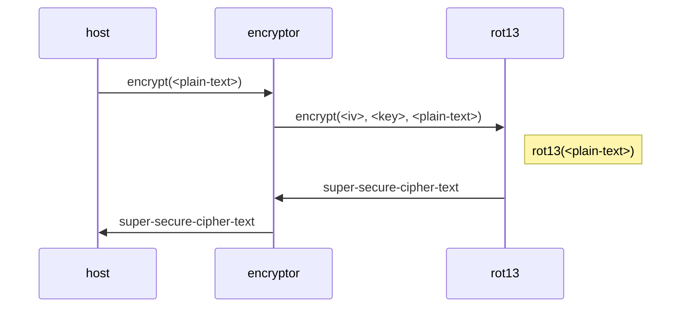
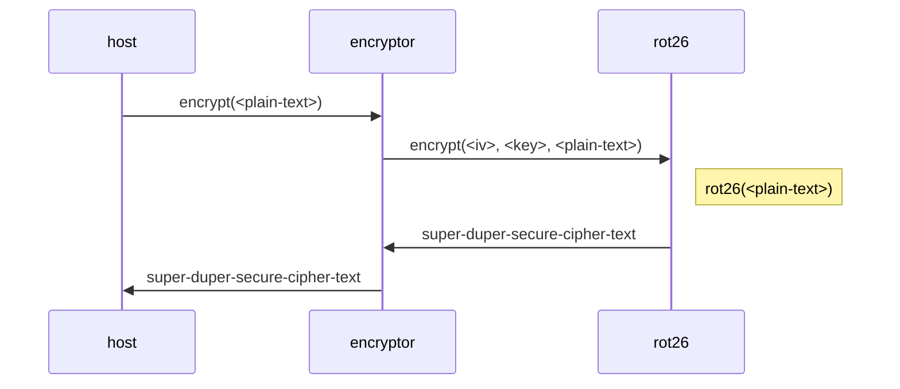

# Component composition example

This directory contains a simple example of how to use `wasm-compose`
to compose a component from other components.

## Directory layout

There are four subdirectories in this example:

* `rot13` - a super-secure encryption algorithm component.
* `rot26` - a super-duper-secure encryption algorithm component.
* `encryptor` - a component that encrypts data when given an algorithm implementation to use.
* `host` - a custom host that instantiates a composed `encryptor` component.

## Overview

The _encryption algorithm_ interface is defined in `encryption.wit` as:

```wit
encrypt: func(iv: list<u8>, key: list<u8>, plain-text: list<u8>) -> list<u8>
```

The example will compose an `encryptor` component that initially will execute like
this:



Later it is discovered that `rot13` has been cracked and is no longer cryptographically
secure.

A better, more secure, encryption algorithm is now needed. Behold, `rot26` with twice the
encrypting power!

By changing how the `encryptor` component is composed, the execution will
change to:



All without having to rebuild any of the original components!

## Getting started

The components in this example will be built with [`cargo component`](https://github.com/bytecodealliance/cargo-component).

Follow the [installation instructions](https://github.com/bytecodealliance/cargo-component#installation)
to install `cargo component` locally.

Additionally, it is assumed that `wasm-tools` has been installed from the root of this repository.

## Building the components

To build the `rot13` component, use `cargo component build`:

```sh
cd rot13
cargo component build --release
```

To build the `rot26` component, use `cargo component build`:

```sh
cd rot26
cargo component build --release
```

Finally, to build the `encryptor` component, use `cargo component build`:

```sh
cd encryptor
cargo component build --release
```

## Composing the component

Initially, the host defines a composition configuration for the `encryptor` component
that looks like this:

```yml
output: encryptor.wasm

components:
  rot13:
    path: ../rot13/target/wasm32-unknown-unknown/release/rot13.wasm
  rot26:
    path: ../rot26/target/wasm32-unknown-unknown/release/rot26.wasm
  encryptor:
    path: ../encryptor/target/wasm32-unknown-unknown/release/encryptor.wasm

instantiations:
  encryptor:
    dependencies: [rot13]

exports:
  default: encryptor
```

This configuration will instantiate the `rot13` component and pass it as an
argument to the instantiation of the `encryptor` component.

It will then export the default interface of the original `encryptor` component
so it can run in a host that expects a `encryptor` component.

It's important to note that this configuration embeds the original
components in the composed component because Wasmtime does not support
component imports currently.

To compose the `encryptor` component:

```sh
cd host
wasm-tools compose
```

There should now be a `encryptor.wasm` in the `host` directory.

## Running the host

The host can be run with `cargo run`:

```sh
cd host
echo 'hello world!' | cargo run --release
```

This should output an indecipherable `uryyb jbeyq!` because the algorithm linked with the `encryptor` component
is `rot13`.

## Changing the composition

To change the composition of the `encryptor` component to use the even-more-secure `rot26` algorithm, edit
`./host/wasm-compose.yml` and change the following line:

```yml
    dependencies: [rot13]
```

to:

```yml
    dependencies: [rot26]
```

And run `wasm-compose` again:

```sh
cd host
wasm-tools compose
```

This results in a new `encryptor.wasm` in the `host` directory where the
algorithm used is now the military-grade `rot26` algorithm.

## Running the host again

The host can be run again with `cargo run`:

```sh
cd host
echo 'hello world!' | cargo run --release
```

This should now output `hello world!` because...wait, what? That cryptography sales guy lied to me! 😡
